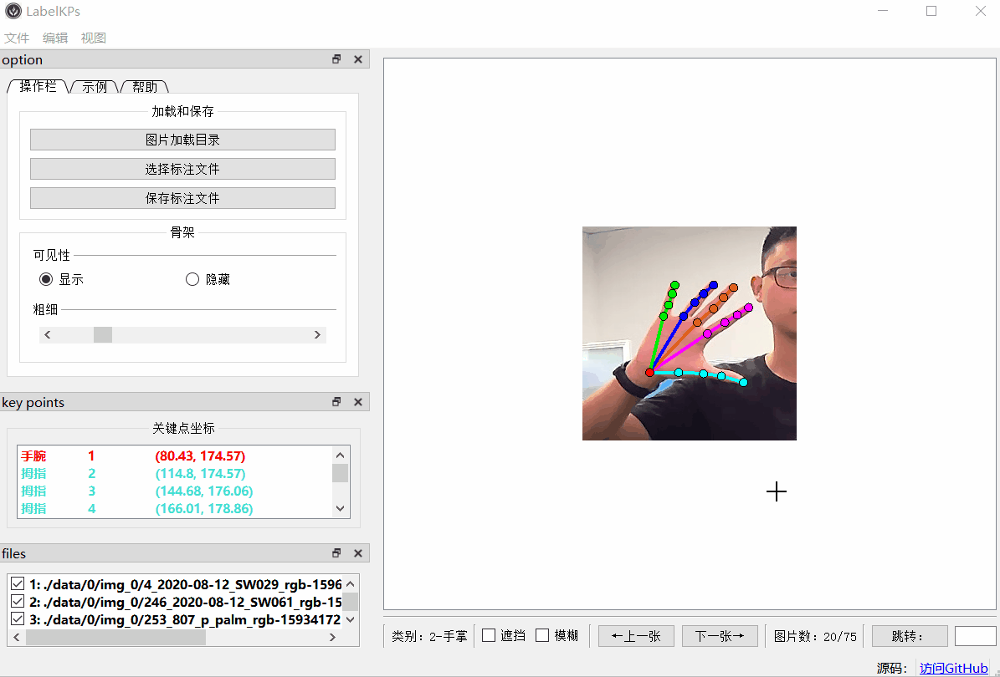
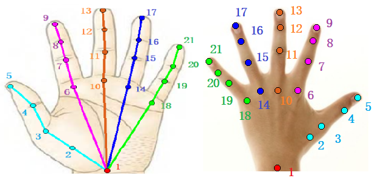
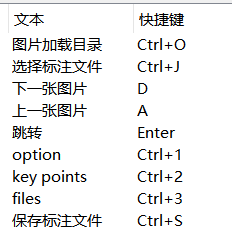
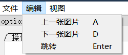
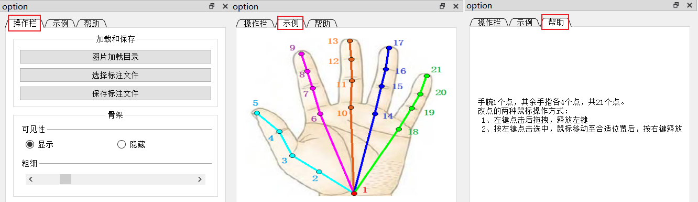
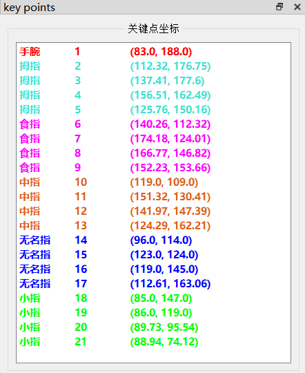
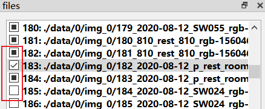

# LabelKPs
 An annotation tool for keypoints 
 <table>
 <tr>
  <td align="center"></td>
 </tr>
</table>

​	LabelKPs 是一个2D手部关键点的标注工具，使用PySide2实现，用pyinstaller生成.exe可执行文件后，可以不用安装python环境，直接使用。

​	为了减少标注量，先使用现有的手部姿态估计模型（如：[MMPose](https://github.com/open-mmlab/mmpose)项目所集成的模型），获取自己的数据集的初步的关键点标注（结果以COCO数据集的格式保存），然后再用标注工具读入关键点进行修改。

 <table>
 <tr>
  <td align="center"></td>
 </tr>
</table>

-----------

# 1、标注工具功能介绍

--------------

## 1.1、快捷键

 <table>
 <tr>
  <td align="center"></td>
 </tr>
</table>

点击菜单栏也可以看到快捷键：

 <table>
 <tr>
  <td align="center"></td>
 </tr>
</table>

**放缩图像的方法：**

+ CTRL + 滑轮 来缩放图片
+ 若无效，应该先点击一次图片区域。

---------------

## 1.2、视图

> 这里有三个dockWidget视图：
>
> + 1、option：
>
>    <table>
>    <tr>
>     <td align="center"></td>
>    </tr>
>   </table>
>
>   + **操作栏**中可以调整骨架大小/可见性，用于方便观察关键点位置。
>
>   + **示例**中说明了各个关键点的位置，请首次标注时，应该先观察好该图。
>
>   + **帮助**中说明了两种移动关键点的方法。
>
> 
>
> + 2、key points：  用于查看关键点颜色、序号、坐标，在选中某一关键点时，该列表相应关键点行高亮显示。若用不上，可以将这个视图关闭。
>
>    <table>
>    <tr>
>     <td align="center"></td>
>    </tr>
>   </table>
>
> 
>
> + 3、files：	file视图用于检查样本的标注情况，共有三种状态：
>
>  <table>
>  <tr>
>   <td align="center"></td>
>  </tr>
> </table>
>
> ​	
>
> + 实心：表示查看过图片，但没有修改关键点的样本。
>
> + 打勾：表示修改过关键点的样本
>
> + 空心：表示未查看，未修改，待处理的样本。
>
>   我们可以通过**跳转**功能，跳到相应序号的样本进行处理。
>

-----
