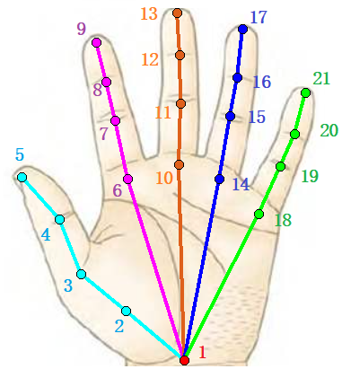

# 半自动手部关键点标注工具
## 1、工具用途
该工具主要用于标注RGB图像中的手部关键点坐标, 为了降低标注工作量，我们采用Google的Hand MediaPipe对手部数据集进行关键点识别，然后在识别结果上进行修改，由于大多数情况下识别效果较好，因此可以不用进行人为修改，从而有效降低标注工作量。需要标注的21个关键点如下图所示：

## 2、标注效率

该工具对500张图片，每组100张图片进行标注测试，使用MediaPipe识别出来的有效图片（不模糊，不漏检），平均保留下来94.1%的样本。在保留的样本中进行下一步的人工修改，平均修改率为33.5%，说明该工具可以有效降低人工标注成本。目前已经使用该工具获取了近8k样本。

---------------------

## 3、开发工具
+ Python3.8
+ PySide2: 用于编写QT图形化界面
+ PyInstaller: 用于封装程序，使该工具可以不用配置环境，直接可以在不同window环境下运行。
+ MediaPipe: 手部关键点估计，用于自动获取关键点伪标签。
+ Json: 用于读写COCO数据集格式的关键的标注文件。
----------------

## 4、软件效果

--------------------------

## 5、已完成的功能
+ 图片加载、图片关键点检测与显示，图片跳转功能
+ 修改关键点坐标的功能
  + 图片缩放、关键点拖拽移动
  + 骨架可见性和粗细变化
+ 设置图片手势类别、设置丢弃和模糊标志位
+ 关键点坐标列表
+ 文件列表——显示图片的检查情况。
+ 操作快捷键
